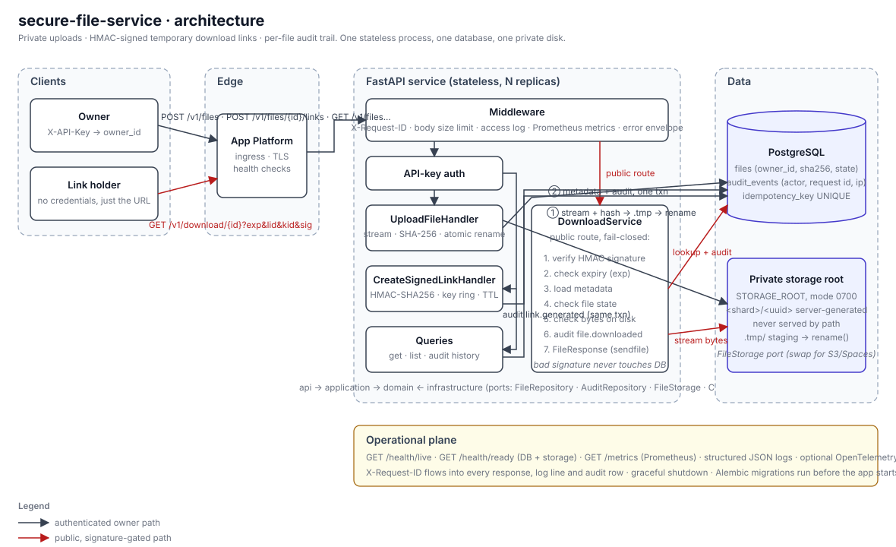

# Architecture

This document is the anchor for the technical review. It explains what the service does, how a
request travels through it, where data lives, how it fails and how it grows.

## 1. Problem and context

Users need to store private files on a server and hand out temporary download links to people
who have no account. The service must therefore:

- accept uploads and keep the bytes where a web server will never serve them directly;
- attribute every file to a user id;
- mint links that a stranger can use for a bounded time, that cannot be forged or extended, and
  that keep working if the service restarts or runs on more than one instance;
- let owners see what they have stored and who minted links, and keep an audit trail.

## 2. Requirements

Functional (from the brief) and how each is met:

| # | Requirement | Implementation |
|---|---|---|
| F1 | Upload to a non-public local directory, associated with a user id | `UploadFileHandler` streams into `STORAGE_ROOT/.tmp`, renames atomically into `STORAGE_ROOT/<2-char shard>/<uuid>`; `files.owner_id` comes from the authenticated API key |
| F2 | Signer endpoint with file id + TTL, valid across restarts | `CreateSignedLinkHandler` + `UrlSigner` (HMAC-SHA256, secret from config, key ring) |
| F3 | Public endpoint validating signature and expiry, serving the file | `DownloadService.resolve` then Starlette `FileResponse` |
| F4 | Owners query file status; audit event on every link generation | `GET /v1/files…` queries; `audit_events` row `link.generated` written in the same transaction as the link is issued |

Non-functional: production-ready error handling, validation, tests, CI, documentation.

## 3. Quality attributes

In priority order, because they drove the trade-offs:

1. **Correctness of access control**: no way to read a file without a valid signature or
   ownership; no way to forge, extend or transplant a signature.
2. **Durability of metadata**: a file the API says exists must exist; bytes without metadata are
   garbage to be swept, metadata without bytes is a served error and is logged loudly.
3. **Operability**: every failure is diagnosable from a request id; probes reflect reality;
   shutdown is graceful.
4. **Simplicity**: one process, one database, one disk. Extension points where growth is likely.
5. **Performance**: uploads stream in 64 KiB chunks; the download hot path does one HMAC, one
   primary-key lookup, one insert and one `sendfile`.

## 4. Architecture overview



Component view in text:

```
                     ┌──────────────────────────┐
                     │  DigitalOcean App Platform│
                     │  ingress · TLS · health   │
                     └─────────────┬─────────────┘
                                   │
      ┌────────────────────────────▼────────────────────────────┐
      │ FastAPI service (stateless)                              │
      │                                                          │
      │  api/          middleware (request id, body limit,       │
      │                access log + metrics), routers, error map │
      │  application/  UploadFileHandler · CreateSignedLink…     │
      │                DeleteFileHandler · DownloadService ·     │
      │                queries                                   │
      │  domain/       entities · ports · services · state       │
      │  infrastructure/ SQLAlchemy repos · LocalFileStorage     │
      │  core/         config · UrlSigner · logging · metrics    │
      └───────────┬──────────────────────────────┬───────────────┘
                  │                              │
        ┌─────────▼─────────┐          ┌─────────▼──────────┐
        │ PostgreSQL         │          │ Private storage root│
        │ files              │          │ 0700, random keys,  │
        │ audit_events       │          │ never served by path│
        └────────────────────┘          └─────────────────────┘

        ┌──────────────────────────────────────────────────────┐
        │ Operational plane: JSON logs · /metrics · /health/*  │
        │ X-Request-ID on every response and audit row         │
        └──────────────────────────────────────────────────────┘
```

Dependency direction: `api → application → domain ← infrastructure`. The domain imports nothing
from FastAPI or SQLAlchemy. Application handlers depend on `Protocol` ports (`FileRepository`,
`AuditRepository`, `FileStorage`, `Clock`); infrastructure implements them. Unit tests substitute
in-memory fakes (`tests/fixtures/fakes.py`).

## 5. Request and data flow

### 5.1 Upload

```
client ──multipart──► BodySizeLimitMiddleware (Content-Length ≤ MAX_UPLOAD_BYTES + 64 KiB, and
                      enforced again while streaming)
       ──► RequestIdMiddleware (preserve valid X-Request-ID or mint req_<uuid>)
       ──► get_current_user: X-API-Key → owner_id (constant-time), else 401
       ──► UploadFileHandler.execute
             1. storage.write(stream): .tmp/<uuid>.part, sha256 while writing, abort > max,
                fsync, os.replace → <shard>/<key>          (EmptyUpload → 422, TooLarge → 413)
             2. Idempotency-Key present? find_by_idempotency_key(owner, key)
                  hit + same sha256/size → delete new bytes, return existing (200)
                  hit + different content → delete new bytes, 409 IDEMPOTENCY_KEY_REUSED
             3. INSERT files (flush) + INSERT audit_events(file.uploaded); COMMIT
                  IntegrityError (concurrent same key) → rollback, re-lookup, replay
                  any other failure → rollback, delete bytes, re-raise (500/503)
       ◄── 201 Created, Location: /v1/files/{id}, FileResponse JSON
```

Bytes before metadata, deliberately: the content hash is needed to decide whether an idempotent
replay carries the same payload, and orphaned bytes are harmless (a sweep can reclaim them)
whereas metadata pointing at nothing would be a serving error.

### 5.2 Link generation

```
POST /v1/files/{id}/links {"ttl_seconds": 600}
  ──► auth → owner_id
  ──► validate_ttl(ttl, default=DEFAULT_LINK_TTL, max=MAX_LINK_TTL)   (→ 422 INVALID_TTL)
  ──► files.get_for_owner(id, owner)         (None → 404; deleted → 410 FILE_UNAVAILABLE)
  ──► exp = now + ttl ; link_id = uuid4
  ──► sig = HMAC-SHA256(key[active], "v1\n{file_id}\n{link_id}\n{exp}")  → base64url, 43 chars
  ──► INSERT audit_events(link.generated, actor, link_id, expires_at, ttl, key_id, request_id, ip)
  ──► COMMIT
  ◄── 201 {"url": "{PUBLIC_BASE_URL}/v1/download/{id}?exp=…&lid=…&kid=…&sig=…", "expires_at", …}
```

The audit write and the response are coupled by the transaction: if the insert fails the client
gets a 5xx and no link. There is no state about the link other than the audit row, so the URL is
verifiable by any instance that holds the key ring.

### 5.3 Download

```
GET /v1/download/{id}?exp=&lid=&kid=&sig=      (no credentials)
  ──► query params shape-validated by FastAPI (exp int ≥ 0, sig matches ^[A-Za-z0-9_-]{43}$) → 422
  ──► DownloadService.resolve, in this order and failing closed:
        signer.verify(file_id, lid, exp, kid, sig)      ✗ → 403 LINK_SIGNATURE_INVALID (no DB hit)
        is_expired(exp, clock.now())                    ✗ → 410 LINK_EXPIRED
        files.get(id)                                   ✗ → 404 FILE_NOT_FOUND
        record.is_available                             ✗ → 410 FILE_UNAVAILABLE
        storage.exists(storage_key)                     ✗ → 500 STORAGE_INCONSISTENT (logged ERROR)
        INSERT audit_events(file.downloaded, lid, request_id, ip); COMMIT
  ◄── 200, FileResponse(path) streamed with Content-Disposition: attachment,
      Cache-Control: private, no-store, X-Content-Type-Options: nosniff, ETag: "<sha256>"
```

Signature verification comes first so that garbage or brute-force traffic costs one HMAC and no
I/O. Expiry is inside the signed message: changing `exp` in the URL invalidates `sig`.

### 5.4 Delete

Soft delete: `files.status = deleted`, `deleted_at` set, audit row written, **commit**, then
bytes removed. If the unlink fails the error is logged and the request still succeeds; metadata
is authoritative and a reconciliation sweep can remove leftovers. All outstanding links for the
file return 410 from that moment.

## 6. Components

| Component | Responsibility | Key file |
|---|---|---|
| `RequestIdMiddleware` | Correlation id in scope, ContextVar and response header | `app/api/middleware.py` |
| `BodySizeLimitMiddleware` | Reject by `Content-Length` early; enforce while streaming; 413 | same |
| `AccessLogMiddleware` | One structured line + counters/histograms per request; template routes | same |
| Exception handlers | Map domain errors, validation, HTTP, DB and unexpected errors to one envelope | `app/api/errors.py` |
| Dependencies | Wire settings, session, signer, storage, metrics into handlers per request | `app/api/dependencies.py` |
| `UrlSigner` | Sign/verify with key ring; constant-time compare; stateless | `app/core/security.py` |
| `ApiKeyAuthenticator` | Static key → user id, constant-time over all keys | same |
| Handlers / services | Use cases; own the transaction boundary (`commit` once per use case) | `app/application/**` |
| Domain services | Filename sanitisation, content-type shape, TTL/expiry math | `app/domain/files/services.py` |
| State machine | `available → deleted`; deleted is terminal | `app/domain/files/state.py` |
| Repositories | SQLAlchemy 2.x, map models ↔ entities, UTC-aware datetimes | `app/infrastructure/repositories/` |
| `LocalFileStorage` | Random sharded keys, temp-file + atomic rename, streaming size cap, traversal guard | `app/infrastructure/storage/local.py` |
| Lifecycle | Startup order, readiness flag, graceful shutdown | `app/core/lifecycle.py` |

## 7. Domain model

```
FileRecord                      AuditEvent                    SignedLink (value, never stored)
  id (uuid)                       id                            link_id
  owner_id                        file_id ─┐                    file_id
  original_filename (sanitised)   event_type: file.uploaded |   url
  content_type (normalised)         link.generated |            expires_at
  size_bytes, sha256                file.downloaded |           key_id
  storage_key (server-generated)    file.deleted                ttl_seconds
  status: available | deleted     actor_id (null for downloads)
  idempotency_key?                link_id?, expires_at?
  created_at, updated_at,         request_id?, client_ip?
  deleted_at?                     metadata (JSONB)
```

## 8. Persistence

PostgreSQL via SQLAlchemy 2.x with explicit Alembic migrations (never `create_all` in
production). Constraints do the arbitration that application code cannot do safely under
concurrency: `UNIQUE(owner_id, idempotency_key)` and `UNIQUE(storage_key)`. Both hot queries have
a covering composite index. `audit_events.file_id` cascades on delete so a future hard-delete
job cannot leave dangling trails. All timestamps are `TIMESTAMPTZ`; repositories normalise to
UTC-aware `datetime`s even on SQLite so business logic never sees naive values.

Engine: `pool_pre_ping`, `pool_size`/`max_overflow` from config, `connect_timeout` and
`statement_timeout` set per connection so no query can hang a worker indefinitely.

## 9. Processing model

Synchronous, request-scoped. Uvicorn runs the ASGI app; endpoint functions are `def` (not
`async def`) so FastAPI runs them in the thread pool, which is right for blocking file and
database I/O with psycopg 3 sync. Streaming happens in fixed 64 KiB chunks so memory is flat
regardless of file size.

## 10. Sync vs async decision

Everything an upload needs (hash, persist, audit) completes in tens of milliseconds for the
target sizes, so a queue would add operational surface without improving latency or durability.
The moment a step becomes slow or unreliable (malware scan, transcoding, external notification),
it belongs behind a durable queue with a worker, and the natural seam is after the `files` row is
committed: emit an outbox row, let a worker pick it up. See [SCALING.md](SCALING.md).

## 11. Idempotency

```
Idempotency-Key ──► lookup(owner, key)
                     ├── hit, same sha256+size ─► 200 existing record
                     ├── hit, different       ─► 409 IDEMPOTENCY_KEY_REUSED
                     └── miss ─► insert ─► IntegrityError? ─► rollback, re-lookup ─► replay
```

Scoped per owner so two tenants cannot collide. The unique constraint, not the lookup, is the
source of truth under concurrency; the integration suite drives 16 parallel identical uploads and
asserts exactly one row and one `file.uploaded` event.

## 12. Error handling

One envelope for everything: `{"error": {"code", "message", "details[]", "request_id"}}`.
Domain exceptions carry a stable `code` and are mapped to HTTP statuses in one table
(`DOMAIN_STATUS`). Validation errors list `field` and `reason`. Anything ≥ 500 hides its message,
logs the stack trace with the request id, and returns only the id. `OperationalError` (database
unreachable) is a 503 so clients and load balancers retry; other `SQLAlchemyError`s are 500.

## 13. Failure model

Summarised in [FAILURE_MODES.md](FAILURE_MODES.md). Principles: fail closed on the download
path; never leave metadata without bytes; readiness reflects dependency health; every failure
increments a labelled counter so the dashboard shows *why* things fail, not just that they do.

## 14. Observability

Structured JSON logs with request and user correlation; Prometheus metrics with bounded label
cardinality (route templates, not raw paths); readiness/liveness split; optional OpenTelemetry
spans across FastAPI and SQLAlchemy. Details in [OBSERVABILITY.md](OBSERVABILITY.md).

## 15. Security

Summarised in [SECURITY.md](SECURITY.md). The two invariants that matter most: bytes are never
addressable by client-controlled paths, and a link's authority is exactly the tuple it was signed
over (file, link id, expiry) with the server's secret.

## 16. Deployment

Docker image (multi-stage, non-root uid 10001) built from the repository by App Platform; a
`PRE_DEPLOY` job applies migrations; the service's readiness probe gates traffic. Local parity
via Docker Compose with the same image. See [DEPLOYMENT.md](DEPLOYMENT.md).

## 17. Scaling

The API is stateless apart from the storage directory. Path: object storage adapter (Spaces),
N replicas, managed PostgreSQL with read replica for audit/list queries, queue + workers for
post-processing, presigned direct downloads to take bytes off the API entirely. See
[SCALING.md](SCALING.md).

## 18. Trade-offs

Catalogued in [TRADEOFFS.md](TRADEOFFS.md) and [DECISIONS.md](DECISIONS.md). The biggest:
stateless links mean no per-link revocation; local disk means single instance until the adapter
is swapped; API keys mean identity is configuration, not a directory.

## 19. Evolution path

```
v1 (now)         API ── PostgreSQL ── local private disk

v1.1             + links table (revocation, download counts) written alongside audit
                 + rate limiting at the edge
v2               + FileStorage adapter for Spaces/S3; presigned GET redirect option
                 + N stateless replicas behind App Platform
v3               + outbox → durable queue → workers (scan, thumbnail, retention)
                 + read replica for audit/list; partition audit_events by month
```

Each step changes one adapter or adds one component; none rewrites the handlers, because the
domain and application layers already depend on ports rather than concrete infrastructure.
